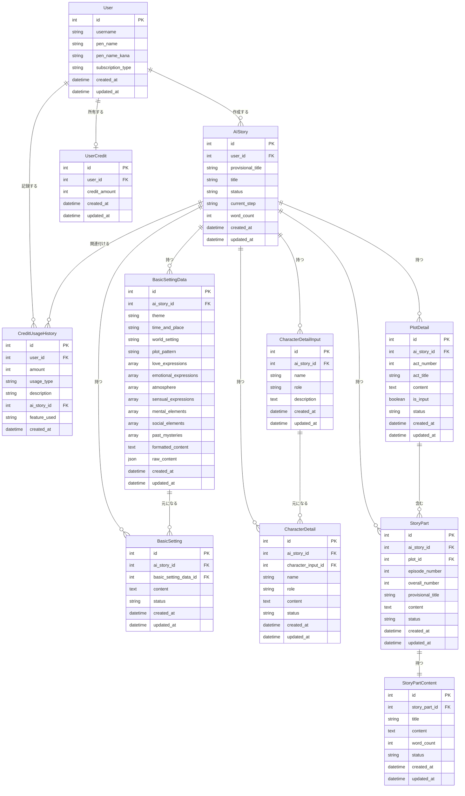

# モデル ER図

```mermaid
erDiagram
    User ||--o{ AIStory : "作成する"
    User ||--o| UserCredit : "所有する"
    User ||--o{ CreditUsageHistory : "記録する"

    AIStory ||--o{ BasicSettingData : "持つ"
    AIStory ||--o{ BasicSetting : "持つ"
    AIStory ||--o{ CharacterDetailInput : "持つ"
    AIStory ||--o{ CharacterDetail : "持つ"
    AIStory ||--o{ PlotDetail : "持つ"
    AIStory ||--o{ StoryPart : "持つ"
    AIStory ||--o{ CreditUsageHistory : "関連付ける"

    BasicSettingData ||--o{ BasicSetting : "元になる"

    CharacterDetailInput ||--o{ CharacterDetail : "元になる"

    PlotDetail ||--o{ StoryPart : "含む"

    StoryPart ||--|| StoryPartContent : "持つ"

    User {
        int id PK
        string username
        string pen_name
        string pen_name_kana
        string subscription_type
        datetime created_at
        datetime updated_at
    }

    UserCredit {
        int id PK
        int user_id FK
        int credit_amount
        datetime created_at
        datetime updated_at
    }

    CreditUsageHistory {
        int id PK
        int user_id FK
        int amount
        string usage_type
        string description
        int ai_story_id FK
        string feature_used
        datetime created_at
    }

    AIStory {
        int id PK
        int user_id FK
        string provisional_title
        string title
        string status
        string current_step
        int word_count
        datetime created_at
        datetime updated_at
    }

    BasicSettingData {
        int id PK
        int ai_story_id FK
        string theme
        string time_and_place
        string world_setting
        string plot_pattern
        array love_expressions
        array emotional_expressions
        array atmosphere
        array sensual_expressions
        array mental_elements
        array social_elements
        array past_mysteries
        text formatted_content
        json raw_content
        datetime created_at
        datetime updated_at
    }

    BasicSetting {
        int id PK
        int ai_story_id FK
        int basic_setting_data_id FK
        text content
        string status
        datetime created_at
        datetime updated_at
    }

    CharacterDetailInput {
        int id PK
        int ai_story_id FK
        string name
        string role
        text description
        datetime created_at
        datetime updated_at
    }

    CharacterDetail {
        int id PK
        int ai_story_id FK
        int character_input_id FK
        string name
        string role
        text content
        string status
        datetime created_at
        datetime updated_at
    }

    PlotDetail {
        int id PK
        int ai_story_id FK
        int act_number
        string act_title
        text content
        boolean is_input
        string status
        datetime created_at
        datetime updated_at
    }

    StoryPart {
        int id PK
        int ai_story_id FK
        int plot_id FK
        int episode_number
        int overall_number
        string provisional_title
        text content
        string status
        datetime created_at
        datetime updated_at
    }

    StoryPartContent {
        int id PK
        int story_part_id FK
        string title
        text content
        int word_count
        string status
        datetime created_at
        datetime updated_at
    }
```
